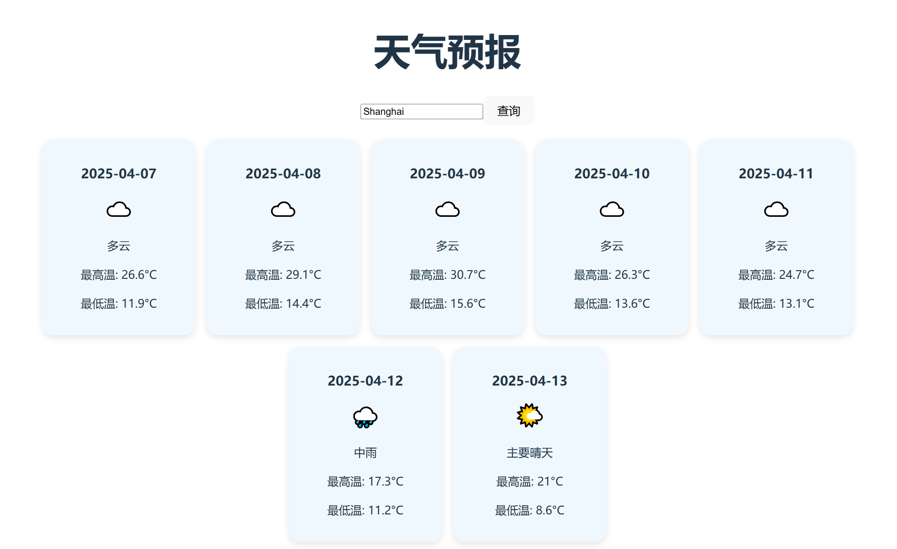

# Weather-app

A lightweight weather forecast application that delivers accurate weather information for any city.



## Features
- Real-time weather forecasts
- City-specific weather information
- Clean and intuitive interface

## Getting Started

To launch the application:
```bash
npm run dev
```

## Project Structure
- `src/` - Source code directory
  - `assets/` - Static assets including weather code definitions and preview images
  - `components/` - React components
  - `styles/` - CSS stylesheets

## Technologies Used
- React
- TypeScript
- Vite
- Open-Meteo API